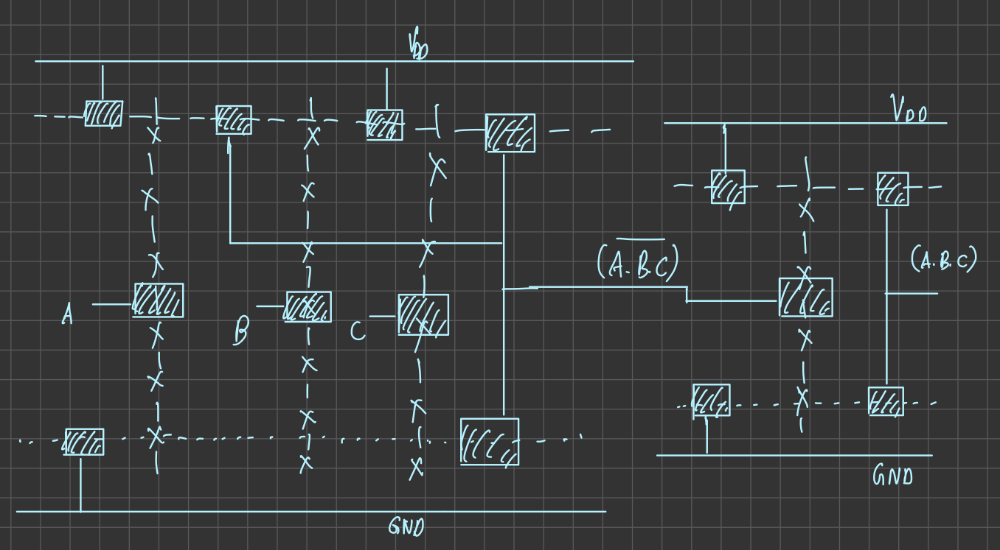
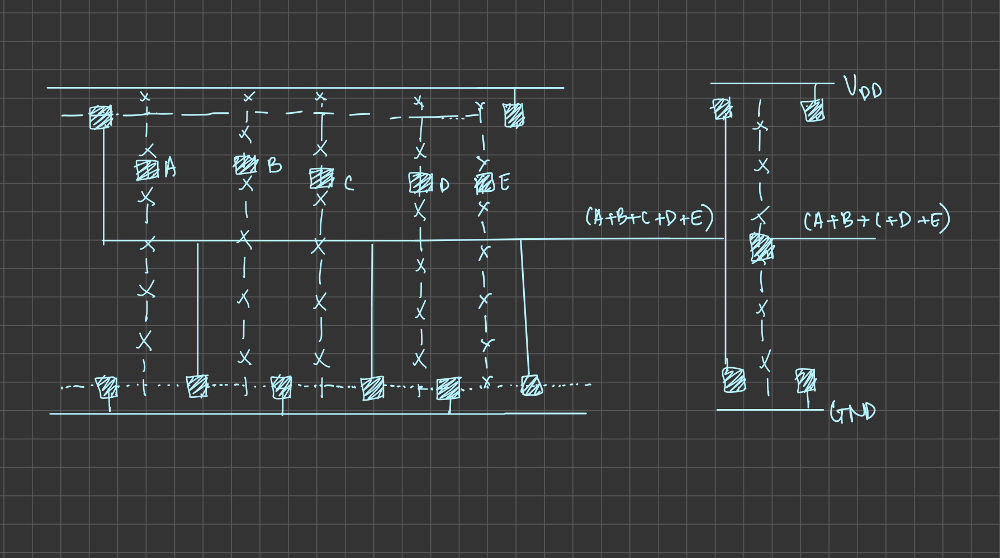

---
geometry:

- top=25mm
- left=25mm
- right=25mm
- heightrounded 
...

\clearpage
\tableofcontents
\clearpage

## Proposed Structure

The carry look ahead adder is an adder that aims to correct a few flaws that exist in the ripple adder design. As the ripple adder heavily depends on cascading stages and inputs, it is prone to face a lot of delay in producing the output, and this is undesirable. The carry look ahead adder performs the same task using just the inputs it is given and without any cascading, hence greatly reducing the delay. To do this, we precompute two sets of values, called the **carry propagate ($p_i$)** and the **carry generate ($g_i$)**, which depend on nothing but the entered input values. These generated sets of values can then be used to readily calculate the carries for each bit, and hence, we have the carries for all places without calculating the sum bits. 

The proposed design for the carry look ahead adder takes in the following inputs.

- $a_3, a_2, a_1, a_0 \to$ 4 bit input addend 

- $b_3, b_2, b_1, b_0 \to$ 4 bit input addend

- $c_0 \to$ Input carry

It gives the final output carry and four sum bits as the output. The design used in this project follows **complementary CMOS logic design**. The gates (AND, OR and XOR) used in the adder have been designed using complementary CMOS logic and have then been connected as per the equations specified for the carry look ahead logic design. Broadly, we have three segments in the adder which are 

- Propoagate and Generate block

- Carry Look Ahead block

- Sum block

The first block comptes the values for the propagate and generate, the second block uses those values to compute the carries for each stage, while the third block combines all these values to then compute the final sum bits.

## Dimensions of the Gates Used

| Gate | Dimensions (in $\lambda$) |
| --- | --- |
| AND (2 input) | 90x57 |
| OR (2 input) | 96x67 |
| AND (3 input) | 96x59 |
| OR (3 input) | 102x67 |
| AND (4 input) | 130x57 |
| OR (4 input) | 121x67 |
| XOR (2 input) | 128x118 |

These are the gates used to design the carry look ahead adder. All the gates have been designed with standard complementary CMOS logic.

\pagebreak
## Stick Diagrams of Gates Used








\pagebreak
## Layout of each block in MAGIC


These layouts have been verified in assignment 3, and the extracted NGSPICE code and waveforms are given in the assignment 3 report.

\pagebreak
## NGSPICE code for the Carry Look Ahead Adder

```cpp
.include TSMC_180nm.txt
.param SUPPLY=1.8
.param LAMBDA=0.09u
.global gnd vdd

Vdd	vdd	gnd	'SUPPLY'
vc0 c0 gnd 0
va3 a3 gnd 0
vb3 b3 gnd 0
va2 a2 gnd 0
vb2 b2 gnd 0
va1 a1 gnd 0
vb1 b1 gnd 0
va0 a0 gnd 0
vb0 b0 gnd 0

**OR Gate
.subckt or i1 i2 out vdd gnd
.param width_P={40*LAMBDA}
.param width_N={20*LAMBDA}

**NMOS 
M1      out1       i1       gnd     gnd  CMOSN   W={width_N}   L={2*LAMBDA}
+ AS={5*width_N*LAMBDA} PS={10*LAMBDA+2*width_N} AD={5*width_N*LAMBDA} PD={10*LAMBDA+2*width_N}
M2      out1        i2       gnd     gnd  CMOSN   W={width_N}   L={2*LAMBDA}
+ AS={5*width_N*LAMBDA} PS={10*LAMBDA+2*width_N} AD={5*width_N*LAMBDA} PD={10*LAMBDA+2*width_N}

**PMOS
M3      1       i1    vdd       vdd    CMOSP   W={width_P}   L={2*LAMBDA}
+ AS={5*width_P*LAMBDA} PS={10*LAMBDA+2*width_P} AD={5*width_P*LAMBDA} PD={10*LAMBDA+2*width_P}
M4      out1       i2      1    1    CMOSP   W={width_P}   L={2*LAMBDA}
+ AS={5*width_P*LAMBDA} PS={10*LAMBDA+2*width_P} AD={5*width_P*LAMBDA} PD={10*LAMBDA+2*width_P}

**Inversion segment
M5      out       out1       gnd     gnd  CMOSN   W={width_N}   L={2*LAMBDA}
+ AS={5*width_N*LAMBDA} PS={10*LAMBDA+2*width_N} AD={5*width_N*LAMBDA} PD={10*LAMBDA+2*width_N}
M6      out       out1    vdd       vdd    CMOSP   W={width_P}   L={2*LAMBDA}
+ AS={5*width_P*LAMBDA} PS={10*LAMBDA+2*width_P} AD={5*width_P*LAMBDA} PD={10*LAMBDA+2*width_P}
.ends or

** AND Gate
.subckt and i1 i2 out vdd gnd
.param width_P={40*LAMBDA}
.param width_N={20*LAMBDA}

**NMOS
M1      out1       i1       1     1  CMOSN   W={width_N}   L={2*LAMBDA}
+ AS={5*width_N*LAMBDA} PS={10*LAMBDA+2*width_N} AD={5*width_N*LAMBDA} PD={10*LAMBDA+2*width_N}
M2      1       i2       gnd     gnd  CMOSN   W={width_N}   L={2*LAMBDA}
+ AS={5*width_N*LAMBDA} PS={10*LAMBDA+2*width_N} AD={5*width_N*LAMBDA} PD={10*LAMBDA+2*width_N}

**PMOS
M3      out1       i1    vdd       vdd    CMOSP   W={width_P}   L={2*LAMBDA}
+ AS={5*width_P*LAMBDA} PS={10*LAMBDA+2*width_P} AD={5*width_P*LAMBDA} PD={10*LAMBDA+2*width_P}
M4      out1       i2      vdd    vdd    CMOSP   W={width_P}   L={2*LAMBDA}
+ AS={5*width_P*LAMBDA} PS={10*LAMBDA+2*width_P} AD={5*width_P*LAMBDA} PD={10*LAMBDA+2*width_P}

**Inversion segment
M5      out       out1       gnd     gnd  CMOSN   W={width_N}   L={2*LAMBDA}
+ AS={5*width_N*LAMBDA} PS={10*LAMBDA+2*width_N} AD={5*width_N*LAMBDA} PD={10*LAMBDA+2*width_N}
M6      out       out1    vdd       vdd    CMOSP   W={width_P}   L={2*LAMBDA}
+ AS={5*width_P*LAMBDA} PS={10*LAMBDA+2*width_P} AD={5*width_P*LAMBDA} PD={10*LAMBDA+2*width_P}
.ends and

**XOR Gate
.subckt xor i1 i2 i1bar i2bar out vdd gnd
.param width_P={40*LAMBDA}
.param width_N={20*LAMBDA}

**NMOS
M1      out       i2       3     3  CMOSN   W={width_N}   L={2*LAMBDA}
+ AS={5*width_N*LAMBDA} PS={10*LAMBDA+2*width_N} AD={5*width_N*LAMBDA} PD={10*LAMBDA+2*width_N}
M2      3         i1       gnd     gnd  CMOSN   W={width_N}   L={2*LAMBDA}
+ AS={5*width_N*LAMBDA} PS={10*LAMBDA+2*width_N} AD={5*width_N*LAMBDA} PD={10*LAMBDA+2*width_N}
M3      out       i2bar       4     4  CMOSN   W={width_N}   L={2*LAMBDA}
+ AS={5*width_N*LAMBDA} PS={10*LAMBDA+2*width_N} AD={5*width_N*LAMBDA} PD={10*LAMBDA+2*width_N}
M4      4         i1bar       gnd     gnd  CMOSN   W={width_N}   L={2*LAMBDA}
+ AS={5*width_N*LAMBDA} PS={10*LAMBDA+2*width_N} AD={5*width_N*LAMBDA} PD={10*LAMBDA+2*width_N}

**PMOS
M5      1       i2bar    vdd       vdd    CMOSP   W={width_P}   L={2*LAMBDA}
+ AS={5*width_P*LAMBDA} PS={10*LAMBDA+2*width_P} AD={5*width_P*LAMBDA} PD={10*LAMBDA+2*width_P}
M6      out       i1      1    1    CMOSP   W={width_P}   L={2*LAMBDA}
+ AS={5*width_P*LAMBDA} PS={10*LAMBDA+2*width_P} AD={5*width_P*LAMBDA} PD={10*LAMBDA+2*width_P}
M7      2       i2    vdd       vdd    CMOSP   W={width_P}   L={2*LAMBDA}
+ AS={5*width_P*LAMBDA} PS={10*LAMBDA+2*width_P} AD={5*width_P*LAMBDA} PD={10*LAMBDA+2*width_P}
M8      out       i1bar      2    2    CMOSP   W={width_P}   L={2*LAMBDA}
+ AS={5*width_P*LAMBDA} PS={10*LAMBDA+2*width_P} AD={5*width_P*LAMBDA} PD={10*LAMBDA+2*width_P}
.ends xor

** 3 input OR
.subckt or3 i1 i2 i3 out vdd gnd
.param width_P={40*LAMBDA}
.param width_N={20*LAMBDA}

**NMOS 
M1      out1       i1       gnd     gnd  CMOSN   W={width_N}   L={2*LAMBDA}
+ AS={5*width_N*LAMBDA} PS={10*LAMBDA+2*width_N} AD={5*width_N*LAMBDA} PD={10*LAMBDA+2*width_N}
M2      out1        i2       gnd     gnd  CMOSN   W={width_N}   L={2*LAMBDA}
+ AS={5*width_N*LAMBDA} PS={10*LAMBDA+2*width_N} AD={5*width_N*LAMBDA} PD={10*LAMBDA+2*width_N}
M3      out1        i3       gnd     gnd  CMOSN   W={width_N}   L={2*LAMBDA}
+ AS={5*width_N*LAMBDA} PS={10*LAMBDA+2*width_N} AD={5*width_N*LAMBDA} PD={10*LAMBDA+2*width_N}


**PMOS
M4      1       i1    vdd       vdd    CMOSP   W={width_P}   L={2*LAMBDA}
+ AS={5*width_P*LAMBDA} PS={10*LAMBDA+2*width_P} AD={5*width_P*LAMBDA} PD={10*LAMBDA+2*width_P}
M5      2       i2      1    1    CMOSP   W={width_P}   L={2*LAMBDA}
+ AS={5*width_P*LAMBDA} PS={10*LAMBDA+2*width_P} AD={5*width_P*LAMBDA} PD={10*LAMBDA+2*width_P}
M6      out1       i3      2    2    CMOSP   W={width_P}   L={2*LAMBDA}
+ AS={5*width_P*LAMBDA} PS={10*LAMBDA+2*width_P} AD={5*width_P*LAMBDA} PD={10*LAMBDA+2*width_P}

**Inversion segment
M7      out       out1       gnd     gnd  CMOSN   W={width_N}   L={2*LAMBDA}
+ AS={5*width_N*LAMBDA} PS={10*LAMBDA+2*width_N} AD={5*width_N*LAMBDA} PD={10*LAMBDA+2*width_N}
M8      out       out1    vdd       vdd    CMOSP   W={width_P}   L={2*LAMBDA}
+ AS={5*width_P*LAMBDA} PS={10*LAMBDA+2*width_P} AD={5*width_P*LAMBDA} PD={10*LAMBDA+2*width_P}
.ends or3

** 3 input AND
.subckt and3 i1 i2 i3 out vdd gnd
.param width_P={40*LAMBDA}
.param width_N={20*LAMBDA}

**NMOS
M1      out1       i3       2     2  CMOSN   W={width_N}   L={2*LAMBDA}
+ AS={5*width_N*LAMBDA} PS={10*LAMBDA+2*width_N} AD={5*width_N*LAMBDA} PD={10*LAMBDA+2*width_N}
M2      2       i2       1     1  CMOSN   W={width_N}   L={2*LAMBDA}
+ AS={5*width_N*LAMBDA} PS={10*LAMBDA+2*width_N} AD={5*width_N*LAMBDA} PD={10*LAMBDA+2*width_N}
M3      1       i1       gnd     gnd  CMOSN   W={width_N}   L={2*LAMBDA}
+ AS={5*width_N*LAMBDA} PS={10*LAMBDA+2*width_N} AD={5*width_N*LAMBDA} PD={10*LAMBDA+2*width_N}

**PMOS
M4      out1       i1    vdd       vdd    CMOSP   W={width_P}   L={2*LAMBDA}
+ AS={5*width_P*LAMBDA} PS={10*LAMBDA+2*width_P} AD={5*width_P*LAMBDA} PD={10*LAMBDA+2*width_P}
M5      out1       i2      vdd    vdd    CMOSP   W={width_P}   L={2*LAMBDA}
+ AS={5*width_P*LAMBDA} PS={10*LAMBDA+2*width_P} AD={5*width_P*LAMBDA} PD={10*LAMBDA+2*width_P}
M6      out1       i3      vdd    vdd    CMOSP   W={width_P}   L={2*LAMBDA}
+ AS={5*width_P*LAMBDA} PS={10*LAMBDA+2*width_P} AD={5*width_P*LAMBDA} PD={10*LAMBDA+2*width_P}

**Inversion segment
M7      out       out1       gnd     gnd  CMOSN   W={width_N}   L={2*LAMBDA}
+ AS={5*width_N*LAMBDA} PS={10*LAMBDA+2*width_N} AD={5*width_N*LAMBDA} PD={10*LAMBDA+2*width_N}
M8      out       out1    vdd       vdd    CMOSP   W={width_P}   L={2*LAMBDA}
+ AS={5*width_P*LAMBDA} PS={10*LAMBDA+2*width_P} AD={5*width_P*LAMBDA} PD={10*LAMBDA+2*width_P}
.ends and3

** 4 input AND
.subckt and4 i1 i2 i3 i4 out vdd gnd
.param width_P={40*LAMBDA}
.param width_N={20*LAMBDA}

**NMOS

M1      out1       i4       3     3  CMOSN   W={width_N}   L={2*LAMBDA}
+ AS={5*width_N*LAMBDA} PS={10*LAMBDA+2*width_N} AD={5*width_N*LAMBDA} PD={10*LAMBDA+2*width_N}
M2      3       i3       2     2  CMOSN   W={width_N}   L={2*LAMBDA}
+ AS={5*width_N*LAMBDA} PS={10*LAMBDA+2*width_N} AD={5*width_N*LAMBDA} PD={10*LAMBDA+2*width_N}
M3      2       i2       1     1  CMOSN   W={width_N}   L={2*LAMBDA}
+ AS={5*width_N*LAMBDA} PS={10*LAMBDA+2*width_N} AD={5*width_N*LAMBDA} PD={10*LAMBDA+2*width_N}
M4      1       i1       gnd     gnd  CMOSN   W={width_N}   L={2*LAMBDA}
+ AS={5*width_N*LAMBDA} PS={10*LAMBDA+2*width_N} AD={5*width_N*LAMBDA} PD={10*LAMBDA+2*width_N}


**PMOS
M5      out1       i1    vdd       vdd    CMOSP   W={width_P}   L={2*LAMBDA}
+ AS={5*width_P*LAMBDA} PS={10*LAMBDA+2*width_P} AD={5*width_P*LAMBDA} PD={10*LAMBDA+2*width_P}
M6      out1       i2      vdd    vdd    CMOSP   W={width_P}   L={2*LAMBDA}
+ AS={5*width_P*LAMBDA} PS={10*LAMBDA+2*width_P} AD={5*width_P*LAMBDA} PD={10*LAMBDA+2*width_P}
M7      out1       i3      vdd    vdd    CMOSP   W={width_P}   L={2*LAMBDA}
+ AS={5*width_P*LAMBDA} PS={10*LAMBDA+2*width_P} AD={5*width_P*LAMBDA} PD={10*LAMBDA+2*width_P}
M8      out1       i4      vdd    vdd    CMOSP   W={width_P}   L={2*LAMBDA}
+ AS={5*width_P*LAMBDA} PS={10*LAMBDA+2*width_P} AD={5*width_P*LAMBDA} PD={10*LAMBDA+2*width_P}

**Inversion segment
M9      out       out1       gnd     gnd  CMOSN   W={width_N}   L={2*LAMBDA}
+ AS={5*width_N*LAMBDA} PS={10*LAMBDA+2*width_N} AD={5*width_N*LAMBDA} PD={10*LAMBDA+2*width_N}
M10      out       out1    vdd       vdd    CMOSP   W={width_P}   L={2*LAMBDA}
+ AS={5*width_P*LAMBDA} PS={10*LAMBDA+2*width_P} AD={5*width_P*LAMBDA} PD={10*LAMBDA+2*width_P}
.ends and4

** 4 input OR
.subckt or4 i1 i2 i3 i4 out vdd gnd
.param width_P={40*LAMBDA}
.param width_N={20*LAMBDA}

**NMOS 
M1      out1       i1       gnd     gnd  CMOSN   W={width_N}   L={2*LAMBDA}
+ AS={5*width_N*LAMBDA} PS={10*LAMBDA+2*width_N} AD={5*width_N*LAMBDA} PD={10*LAMBDA+2*width_N}
M2      out1        i2       gnd     gnd  CMOSN   W={width_N}   L={2*LAMBDA}
+ AS={5*width_N*LAMBDA} PS={10*LAMBDA+2*width_N} AD={5*width_N*LAMBDA} PD={10*LAMBDA+2*width_N}
M3      out1        i3       gnd     gnd  CMOSN   W={width_N}   L={2*LAMBDA}
+ AS={5*width_N*LAMBDA} PS={10*LAMBDA+2*width_N} AD={5*width_N*LAMBDA} PD={10*LAMBDA+2*width_N}
M4      out1        i4       gnd     gnd  CMOSN   W={width_N}   L={2*LAMBDA}
+ AS={5*width_N*LAMBDA} PS={10*LAMBDA+2*width_N} AD={5*width_N*LAMBDA} PD={10*LAMBDA+2*width_N}


**PMOS
M5      1       i1    vdd       vdd    CMOSP   W={width_P}   L={2*LAMBDA}
+ AS={5*width_P*LAMBDA} PS={10*LAMBDA+2*width_P} AD={5*width_P*LAMBDA} PD={10*LAMBDA+2*width_P}
M6      2       i2      1    1    CMOSP   W={width_P}   L={2*LAMBDA}
+ AS={5*width_P*LAMBDA} PS={10*LAMBDA+2*width_P} AD={5*width_P*LAMBDA} PD={10*LAMBDA+2*width_P}
M7      3       i3      2    2    CMOSP   W={width_P}   L={2*LAMBDA}
+ AS={5*width_P*LAMBDA} PS={10*LAMBDA+2*width_P} AD={5*width_P*LAMBDA} PD={10*LAMBDA+2*width_P}
M8      out1       i4      3    3    CMOSP   W={width_P}   L={2*LAMBDA}
+ AS={5*width_P*LAMBDA} PS={10*LAMBDA+2*width_P} AD={5*width_P*LAMBDA} PD={10*LAMBDA+2*width_P}

**Inversion segment
M9      out       out1       gnd     gnd  CMOSN   W={width_N}   L={2*LAMBDA}
+ AS={5*width_N*LAMBDA} PS={10*LAMBDA+2*width_N} AD={5*width_N*LAMBDA} PD={10*LAMBDA+2*width_N}
M10      out       out1    vdd       vdd    CMOSP   W={width_P}   L={2*LAMBDA}
+ AS={5*width_P*LAMBDA} PS={10*LAMBDA+2*width_P} AD={5*width_P*LAMBDA} PD={10*LAMBDA+2*width_P}
.ends or4

** 5 input AND
.subckt and5 i1 i2 i3 i4 i5 out vdd gnd
.param width_P={40*LAMBDA}
.param width_N={20*LAMBDA}

**NMOS
M1      out1       i5       4     4  CMOSN   W={width_N}   L={2*LAMBDA}
+ AS={5*width_N*LAMBDA} PS={10*LAMBDA+2*width_N} AD={5*width_N*LAMBDA} PD={10*LAMBDA+2*width_N}
M2      4       i4       3     3  CMOSN   W={width_N}   L={2*LAMBDA}
+ AS={5*width_N*LAMBDA} PS={10*LAMBDA+2*width_N} AD={5*width_N*LAMBDA} PD={10*LAMBDA+2*width_N}
M3      3       i3       2     2  CMOSN   W={width_N}   L={2*LAMBDA}
+ AS={5*width_N*LAMBDA} PS={10*LAMBDA+2*width_N} AD={5*width_N*LAMBDA} PD={10*LAMBDA+2*width_N}
M4      2       i2       1     1  CMOSN   W={width_N}   L={2*LAMBDA}
+ AS={5*width_N*LAMBDA} PS={10*LAMBDA+2*width_N} AD={5*width_N*LAMBDA} PD={10*LAMBDA+2*width_N}
M5      1       i1       gnd     gnd  CMOSN   W={width_N}   L={2*LAMBDA}
+ AS={5*width_N*LAMBDA} PS={10*LAMBDA+2*width_N} AD={5*width_N*LAMBDA} PD={10*LAMBDA+2*width_N}


**PMOS
M6      out1       i1    vdd       vdd    CMOSP   W={width_P}   L={2*LAMBDA}
+ AS={5*width_P*LAMBDA} PS={10*LAMBDA+2*width_P} AD={5*width_P*LAMBDA} PD={10*LAMBDA+2*width_P}
M7      out1       i2      vdd    vdd    CMOSP   W={width_P}   L={2*LAMBDA}
+ AS={5*width_P*LAMBDA} PS={10*LAMBDA+2*width_P} AD={5*width_P*LAMBDA} PD={10*LAMBDA+2*width_P}
M8      out1       i3      vdd    vdd    CMOSP   W={width_P}   L={2*LAMBDA}
+ AS={5*width_P*LAMBDA} PS={10*LAMBDA+2*width_P} AD={5*width_P*LAMBDA} PD={10*LAMBDA+2*width_P}
M9      out1       i4      vdd    vdd    CMOSP   W={width_P}   L={2*LAMBDA}
+ AS={5*width_P*LAMBDA} PS={10*LAMBDA+2*width_P} AD={5*width_P*LAMBDA} PD={10*LAMBDA+2*width_P}
M10     out1       i5      vdd    vdd    CMOSP   W={width_P}   L={2*LAMBDA}
+ AS={5*width_P*LAMBDA} PS={10*LAMBDA+2*width_P} AD={5*width_P*LAMBDA} PD={10*LAMBDA+2*width_P}

**Inversion segment
M11      out       out1       gnd     gnd  CMOSN   W={width_N}   L={2*LAMBDA}
+ AS={5*width_N*LAMBDA} PS={10*LAMBDA+2*width_N} AD={5*width_N*LAMBDA} PD={10*LAMBDA+2*width_N}
M12      out       out1    vdd       vdd    CMOSP   W={width_P}   L={2*LAMBDA}
+ AS={5*width_P*LAMBDA} PS={10*LAMBDA+2*width_P} AD={5*width_P*LAMBDA} PD={10*LAMBDA+2*width_P}
.ends and5

** 5 input OR
.subckt or5 i1 i2 i3 i4 i5 out vdd gnd
.param width_P={40*LAMBDA}
.param width_N={20*LAMBDA}

**NMOS 
M1      out1       i1       gnd     gnd  CMOSN   W={width_N}   L={2*LAMBDA}
+ AS={5*width_N*LAMBDA} PS={10*LAMBDA+2*width_N} AD={5*width_N*LAMBDA} PD={10*LAMBDA+2*width_N}
M2      out1        i2       gnd     gnd  CMOSN   W={width_N}   L={2*LAMBDA}
+ AS={5*width_N*LAMBDA} PS={10*LAMBDA+2*width_N} AD={5*width_N*LAMBDA} PD={10*LAMBDA+2*width_N}
M3      out1        i3       gnd     gnd  CMOSN   W={width_N}   L={2*LAMBDA}
+ AS={5*width_N*LAMBDA} PS={10*LAMBDA+2*width_N} AD={5*width_N*LAMBDA} PD={10*LAMBDA+2*width_N}
M4      out1        i4       gnd     gnd  CMOSN   W={width_N}   L={2*LAMBDA}
+ AS={5*width_N*LAMBDA} PS={10*LAMBDA+2*width_N} AD={5*width_N*LAMBDA} PD={10*LAMBDA+2*width_N}
M5      out1        i5       gnd     gnd  CMOSN   W={width_N}   L={2*LAMBDA}
+ AS={5*width_N*LAMBDA} PS={10*LAMBDA+2*width_N} AD={5*width_N*LAMBDA} PD={10*LAMBDA+2*width_N}


**PMOS
M6      1       i1    vdd       vdd    CMOSP   W={width_P}   L={2*LAMBDA}
+ AS={5*width_P*LAMBDA} PS={10*LAMBDA+2*width_P} AD={5*width_P*LAMBDA} PD={10*LAMBDA+2*width_P}
M7      2       i2      1    1    CMOSP   W={width_P}   L={2*LAMBDA}
+ AS={5*width_P*LAMBDA} PS={10*LAMBDA+2*width_P} AD={5*width_P*LAMBDA} PD={10*LAMBDA+2*width_P}
M8      3       i3      2    2    CMOSP   W={width_P}   L={2*LAMBDA}
+ AS={5*width_P*LAMBDA} PS={10*LAMBDA+2*width_P} AD={5*width_P*LAMBDA} PD={10*LAMBDA+2*width_P}
M9      4       i4      3    3    CMOSP   W={width_P}   L={2*LAMBDA}
+ AS={5*width_P*LAMBDA} PS={10*LAMBDA+2*width_P} AD={5*width_P*LAMBDA} PD={10*LAMBDA+2*width_P}
M10      out1       i5      4    4    CMOSP   W={width_P}   L={2*LAMBDA}
+ AS={5*width_P*LAMBDA} PS={10*LAMBDA+2*width_P} AD={5*width_P*LAMBDA} PD={10*LAMBDA+2*width_P}

**Inversion segment
M11      out       out1       gnd     gnd  CMOSN   W={width_N}   L={2*LAMBDA}
+ AS={5*width_N*LAMBDA} PS={10*LAMBDA+2*width_N} AD={5*width_N*LAMBDA} PD={10*LAMBDA+2*width_N}
M12      out       out1    vdd       vdd    CMOSP   W={width_P}   L={2*LAMBDA}
+ AS={5*width_P*LAMBDA} PS={10*LAMBDA+2*width_P} AD={5*width_P*LAMBDA} PD={10*LAMBDA+2*width_P}
.ends or5

.subckt inv i1 out vdd gnd
.param width_P={40*LAMBDA}
.param width_N={20*LAMBDA}
M11      out       i1       gnd     gnd  CMOSN   W={width_N}   L={2*LAMBDA}
+ AS={5*width_N*LAMBDA} PS={10*LAMBDA+2*width_N} AD={5*width_N*LAMBDA} PD={10*LAMBDA+2*width_N}
M12      out       i1    vdd       vdd    CMOSP   W={width_P}   L={2*LAMBDA}
+ AS={5*width_P*LAMBDA} PS={10*LAMBDA+2*width_P} AD={5*width_P*LAMBDA} PD={10*LAMBDA+2*width_P}
.ends inv

** Netlist description

** Complements, propagates
x1 a0 b0 g0 vdd gnd and
x2 a0 a0bar vdd gnd inv
x3 b0 b0bar vdd gnd inv
x4 a0 b0 a0bar b0bar p0 vdd gnd xor

x5 a1 b1 g1 vdd gnd and
x6 a1 a1bar vdd gnd inv
x7 b1 b1bar vdd gnd inv
x8 a1 b1 a1bar b1bar p1 vdd gnd xor

x9  a2 b2 g2 vdd gnd and
x10 a2 a2bar vdd gnd inv
x11 b2 b2bar vdd gnd inv
x12 a2 b2 a2bar b2bar p2 vdd gnd xor

x13 a3 b3 g3 vdd gnd and
x14 a3 a3bar vdd gnd inv
x15 b3 b3bar vdd gnd inv
x16 a3 b3 a3bar b3bar p3 vdd gnd xor

** Intermediates
x17 p0 c0 p0c0 vdd gnd and
x18 p0 p1 c0 p1p0c0 vdd gnd and3
x19 p0 p1 p2 c0 p2p1p0c0 vdd gnd and4
x20 p0 p1 p2 p3 c0 p3p2p1p0c0 vdd gnd and5

x21 p1 g0 p1g0 vdd gnd and
x22 p2 g1 p2g1 vdd gnd and
x23 p2 p1 g0 p2p1g0 vdd gnd and3
x24 p3 g2 p3g2 vdd gnd and
x25 p3 p2 g1 p3p2g1 vdd gnd and3
x26 p3 p2 p1 g0 p3p2p1g0 vdd gnd and4

** Carries
x27 g0 p0c0 c1 vdd gnd or
x28 g1 p1g0 p1p0c0 c2 vdd gnd or3
x29 g2 p2g1 p2p1g0 p2p1p0c0 c3 vdd gnd or4
x30 g3 p3g2 p3p2g1 p3p2p1g0 p3p2p1p0c0 c4 vdd gnd or5 

** Carry and Propagate complements

x31 p0 p0bar vdd gnd inv
x32 p1 p1bar vdd gnd inv
x33 p2 p2bar vdd gnd inv
x34 p3 p3bar vdd gnd inv

x35 c0 c0bar vdd gnd inv
x36 c1 c1bar vdd gnd inv
x37 c2 c2bar vdd gnd inv
x38 c3 c3bar vdd gnd inv

** Sum bits

x39 p0 c0 p0bar c0bar s0 vdd gnd xor
x40 p1 c1 p1bar c1bar s1 vdd gnd xor
x41 p2 c2 p2bar c2bar s2 vdd gnd xor
x42 p3 c3 p3bar c3bar s3 vdd gnd xor

.tran 0.1n 2n 
.control
run
plot v(s0), (v(s1) + 2), (v(s2) + 4), (v(s3) + 6), (v(c4) + 8)  
* plot v(s3)
set hcopypscolor = 1

.endc
```

### Pre Layout Plots


### Pre Layout Delay results

```
Measurements for Transient Analysis

trise               =  1.420896e-09 targ=  2.192090e-08 trig=  2.050000e-08
tfall               =  4.210945e-10 targ=  3.192109e-08 trig=  3.150000e-08
tpd                 =  9.20995e-10
```

The net delay is about 1 nanosecond, so we can expect it to perform reliably with a clock with frequency $\frac{1}{t_{pd}}$, i.e.

$$Freq = \frac{1}{t_{pd}} = \frac{1}{1ns} = 1GHz$$

This is what the NGSPICE simulation gives us.

## Carry Look Ahead Adder Layout on MAGIC


The dimensions of this layout are 810x510 in $\lambda$. 

The extracted SPICE netlist is given below.

```cpp
* SPICE3 file created from Cadd.ext - technology: scmos

.include TSMC_180nm.txt
.global gnd vdd

Vdd	vdd	gnd	1.8
va3 a3 gnd pulse 0 1.8 0ns 1ns 1ns 80ns 160ns  
va2 a2 gnd pulse 0 1.8 0ns 1ns 1ns 40ns 80ns
va1 a1 gnd pulse 0 1.8 0ns 1ns 1ns 20ns 40ns
va0 a0 gnd pulse 0 1.8 0ns 1ns 1ns 10ns 20ns
vb3 b3 gnd pulse 1.8 0 0ns 1ns 1ns 80ns 160ns  
vb2 b2 gnd pulse 1.8 0 0ns 1ns 1ns 40ns 80ns 
vb1 b1 gnd pulse 1.8 0 0ns 1ns 1ns 20ns 40ns 
vb0 b0 gnd pulse 0 1.8 0ns 1ns 1ns 20ns 40ns 

*va3 a3 gnd 1.8
*vb3 b3 gnd 1.8
*va2 a2 gnd 1.8
*vb2 b2 gnd 1.8
*va1 a1 gnd 1.8
*vb1 b1 gnd 1.8
*va0 a0 gnd 0
*vb0 b0 gnd 1.8
vc0 c0 gnd 0

.option scale=0.09u

M1000 b3c b3 GND Gnd CMOSN w=4 l=2
+  ad=20 pd=18 as=3372 ps=1838
M1001 p2 b2 a_50_485# w_31_479# CMOSP w=9 l=2
+  ad=171 pd=74 as=108 ps=42
M1002 c3 a_207_425# GND Gnd CMOSN w=4 l=2
+  ad=20 pd=18 as=0 ps=0
M1003 g0 a_9_n60# GND Gnd CMOSN w=4 l=2
+  ad=20 pd=18 as=0 ps=0
M1004 b1c b1 VDD w_5_216# CMOSP w=8 l=2
+  ad=40 pd=26 as=4522 ps=2304
M1005 s2 p2c a_353_136# Gnd CMOSN w=9 l=2
+  ad=189 pd=78 as=90 ps=38
M1006 c4 a_223_630# GND Gnd CMOSN w=4 l=2
+  ad=20 pd=18 as=0 ps=0
M1007 s3 p3 a_413_485# w_356_479# CMOSP w=9 l=2
+  ad=171 pd=74 as=135 ps=48
M1008 p1 b1 a_49_259# w_30_253# CMOSP w=9 l=2
+  ad=171 pd=74 as=108 ps=42
M1009 c0c c0 GND Gnd CMOSN w=4 l=2
+  ad=20 pd=18 as=0 ps=0
M1010 a_199_186# p1p0c0 GND Gnd CMOSN w=8 l=2
+  ad=248 pd=94 as=0 ps=0
M1011 a_353_198# p2c VDD w_334_192# CMOSP w=9 l=2
+  ad=90 pd=38 as=0 ps=0
M1012 a_232_568# g1 a_249_542# Gnd CMOSN w=4 l=2
+  ad=56 pd=36 as=36 ps=26
M1013 a_375_485# p3c VDD w_356_479# CMOSP w=9 l=2
+  ad=108 pd=42 as=0 ps=0
M1014 a_207_425# g2 GND Gnd CMOSN w=8 l=2
+  ad=248 pd=94 as=0 ps=0
M1015 iiu a_108_141# VDD w_151_127# CMOSP w=8 l=2
+  ad=40 pd=26 as=0 ps=0
M1016 s2 p2 a_389_198# w_334_192# CMOSP w=9 l=2
+  ad=171 pd=74 as=81 ps=36
M1017 b3c b3 VDD w_n12_625# CMOSP w=8 l=2
+  ad=40 pd=26 as=0 ps=0
M1018 a_50_485# a2c VDD w_31_479# CMOSP w=9 l=2
+  ad=0 pd=0 as=0 ps=0
M1019 a_9_n84# a0 GND Gnd CMOSN w=4 l=2
+  ad=60 pd=38 as=0 ps=0
M1020 s1 p1 a_235_55# w_178_49# CMOSP w=9 l=2
+  ad=171 pd=74 as=81 ps=36
M1021 c3 a_207_425# VDD w_265_437# CMOSP w=8 l=2
+  ad=40 pd=26 as=0 ps=0
M1022 p0 b0 a_42_54# w_23_48# CMOSP w=9 l=2
+  ad=171 pd=74 as=108 ps=42
M1023 GND p3g2 a_223_630# Gnd CMOSN w=8 l=2
+  ad=0 pd=0 as=192 ps=80
M1024 c4 a_223_630# VDD w_292_642# CMOSP w=8 l=2
+  ad=40 pd=26 as=0 ps=0
M1025 a_49_259# a1c VDD w_30_253# CMOSP w=9 l=2
+  ad=0 pd=0 as=0 ps=0
M1026 p0 a0 a_80_n8# Gnd CMOSN w=9 l=2
+  ad=189 pd=78 as=135 ps=48
M1027 a_348_565# p1 VDD w_335_559# CMOSP w=9 l=2
+  ad=324 pd=108 as=0 ps=0
M1028 a_127_565# p3 VDD w_114_559# CMOSP w=9 l=2
+  ad=135 pd=48 as=0 ps=0
M1029 a_n15_141# p1 VDD w_n28_135# CMOSP w=9 l=2
+  ad=234 pd=88 as=0 ps=0
M1030 a_413_485# c3c VDD w_356_479# CMOSP w=9 l=2
+  ad=0 pd=0 as=0 ps=0
M1031 p3 a3 a_77_613# Gnd CMOSN w=9 l=2
+  ad=189 pd=78 as=135 ps=48
M1032 GND c0 c1bar Gnd CMOSN w=8 l=2
+  ad=0 pd=0 as=120 ps=46
M1033 a_n15_115# p1 GND Gnd CMOSN w=4 l=2
+  ad=60 pd=38 as=0 ps=0
M1034 a_80_n8# b0 GND Gnd CMOSN w=9 l=2
+  ad=0 pd=0 as=0 ps=0
M1035 a_235_55# c1c VDD w_178_49# CMOSP w=9 l=2
+  ad=0 pd=0 as=0 ps=0
M1036 a_87_197# b1 GND Gnd CMOSN w=9 l=2
+  ad=81 pd=36 as=0 ps=0
M1037 a_108_116# p1 GND Gnd CMOSN w=4 l=2
+  ad=60 pd=38 as=0 ps=0
M1038 p2p1g0 iiu2 GND Gnd CMOSN w=4 l=2
+  ad=20 pd=18 as=0 ps=0
M1039 a_88_423# b2 GND Gnd CMOSN w=9 l=2
+  ad=135 pd=48 as=0 ps=0
M1040 a_77_675# b3c VDD w_20_669# CMOSP w=9 l=2
+  ad=135 pd=48 as=0 ps=0
M1041 iiu2 g0 a_236_333# Gnd CMOSN w=4 l=2
+  ad=56 pd=36 as=36 ps=26
M1042 p1c p1 GND Gnd CMOSN w=4 l=2
+  ad=20 pd=18 as=0 ps=0
M1043 p0 a0 a_80_54# w_23_48# CMOSP w=9 l=2
+  ad=0 pd=0 as=135 ps=48
M1044 VDD g0 a_348_565# w_335_559# CMOSP w=9 l=2
+  ad=0 pd=0 as=0 ps=0
M1045 s2 c2 a_353_198# w_334_192# CMOSP w=9 l=2
+  ad=0 pd=0 as=0 ps=0
M1046 VDD b2 a_7_358# w_n6_352# CMOSP w=9 l=2
+  ad=0 pd=0 as=135 ps=48
M1047 c0c c0 VDD w_283_13# CMOSP w=8 l=2
+  ad=40 pd=26 as=0 ps=0
M1048 VDD p0 a_n15_141# w_n28_135# CMOSP w=9 l=2
+  ad=0 pd=0 as=0 ps=0
M1049 a_197_55# p1c VDD w_178_49# CMOSP w=9 l=2
+  ad=108 pd=42 as=0 ps=0
M1050 a_2_115# p0 a_n15_115# Gnd CMOSN w=4 l=2
+  ad=36 pd=26 as=0 ps=0
M1051 p3p2g1 a_232_568# GND Gnd CMOSN w=4 l=2
+  ad=20 pd=18 as=0 ps=0
M1052 a_381_541# p1 a_363_541# Gnd CMOSN w=4 l=2
+  ad=92 pd=54 as=64 ps=40
M1053 p2c p2 GND Gnd CMOSN w=4 l=2
+  ad=20 pd=18 as=0 ps=0
M1054 VDD g2 a_127_565# w_114_559# CMOSP w=9 l=2
+  ad=0 pd=0 as=0 ps=0
M1055 a_127_541# p3 GND Gnd CMOSN w=4 l=2
+  ad=60 pd=38 as=0 ps=0
M1056 a_80_54# b0c VDD w_23_48# CMOSP w=9 l=2
+  ad=0 pd=0 as=0 ps=0
M1057 a_232_568# g1 VDD w_219_562# CMOSP w=9 l=2
+  ad=234 pd=88 as=0 ps=0
M1058 p1c p1 VDD w_144_57# CMOSP w=8 l=2
+  ad=40 pd=26 as=0 ps=0
M1059 iiu a_108_141# GND Gnd CMOSN w=4 l=2
+  ad=20 pd=18 as=0 ps=0
M1060 p1p0c0 a_n15_141# GND Gnd CMOSN w=4 l=2
+  ad=20 pd=18 as=0 ps=0
M1061 a_210_130# a1 VDD w_197_124# CMOSP w=9 l=2
+  ad=135 pd=48 as=0 ps=0
M1062 g0 a_9_n60# VDD w_52_n74# CMOSP w=8 l=2
+  ad=40 pd=26 as=0 ps=0
M1063 a_108_141# g0 a_108_116# Gnd CMOSN w=4 l=2
+  ad=40 pd=28 as=0 ps=0
M1064 a_n15_141# c0 VDD w_n28_135# CMOSP w=9 l=2
+  ad=0 pd=0 as=0 ps=0
M1065 p3 a3 a_77_675# w_20_669# CMOSP w=9 l=2
+  ad=171 pd=74 as=0 ps=0
M1066 a_n15_141# c0 a_2_115# Gnd CMOSN w=4 l=2
+  ad=56 pd=36 as=0 ps=0
M1067 a_214_219# iiu a_199_219# w_180_213# CMOSP w=12 l=2
+  ad=168 pd=52 as=156 ps=50
M1068 c1 c1bar GND Gnd CMOSN w=4 l=2
+  ad=20 pd=18 as=0 ps=0
M1069 a_88_485# b2c VDD w_31_479# CMOSP w=9 l=2
+  ad=135 pd=48 as=0 ps=0
M1070 g2 a_7_358# GND Gnd CMOSN w=4 l=2
+  ad=20 pd=18 as=0 ps=0
M1071 p2c p2 VDD w_298_203# CMOSP w=8 l=2
+  ad=40 pd=26 as=0 ps=0
M1072 a_348_565# g0 a_381_541# Gnd CMOSN w=4 l=2
+  ad=40 pd=28 as=0 ps=0
M1073 a_389_136# c2 GND Gnd CMOSN w=9 l=2
+  ad=81 pd=36 as=0 ps=0
M1074 a_7_358# b2 a_7_334# Gnd CMOSN w=4 l=2
+  ad=40 pd=28 as=60 ps=38
M1075 a_87_259# b1c VDD w_30_253# CMOSP w=9 l=2
+  ad=81 pd=36 as=0 ps=0
M1076 b0c b0 VDD w_n4_7# CMOSP w=8 l=2
+  ad=40 pd=26 as=0 ps=0
M1077 p2 a2 a_88_423# Gnd CMOSN w=9 l=2
+  ad=189 pd=78 as=0 ps=0
M1078 iiu2 g0 VDD w_206_353# CMOSP w=9 l=2
+  ad=234 pd=88 as=0 ps=0
M1079 a_7_358# a2 VDD w_n6_352# CMOSP w=9 l=2
+  ad=0 pd=0 as=0 ps=0
M1080 a3c a3 GND Gnd CMOSN w=4 l=2
+  ad=20 pd=18 as=0 ps=0
M1081 a_108_141# p1 VDD w_95_135# CMOSP w=9 l=2
+  ad=135 pd=48 as=0 ps=0
M1082 a_127_565# g2 a_127_541# Gnd CMOSN w=4 l=2
+  ad=40 pd=28 as=0 ps=0
M1083 VDD p2 a_348_565# w_335_559# CMOSP w=9 l=2
+  ad=0 pd=0 as=0 ps=0
M1084 g2 a_7_358# VDD w_50_344# CMOSP w=8 l=2
+  ad=40 pd=26 as=0 ps=0
M1085 s0 p0c a_329_n3# Gnd CMOSN w=9 l=2
+  ad=189 pd=78 as=81 ps=36
M1086 s1 p1c a_197_n7# Gnd CMOSN w=9 l=2
+  ad=189 pd=78 as=108 ps=42
M1087 a_223_663# g3 VDD w_204_657# CMOSP w=12 l=2
+  ad=108 pd=42 as=0 ps=0
M1088 p3p2g1 a_232_568# VDD w_290_554# CMOSP w=8 l=2
+  ad=40 pd=26 as=0 ps=0
M1089 c1c c1 VDD w_153_10# CMOSP w=8 l=2
+  ad=40 pd=26 as=0 ps=0
M1090 a0c a0 GND Gnd CMOSN w=4 l=2
+  ad=20 pd=18 as=0 ps=0
M1091 VDD b1 a_210_130# w_197_124# CMOSP w=9 l=2
+  ad=0 pd=0 as=0 ps=0
M1092 GND iiu a_199_186# Gnd CMOSN w=8 l=2
+  ad=0 pd=0 as=0 ps=0
M1093 a_42_n8# a0c GND Gnd CMOSN w=9 l=2
+  ad=108 pd=42 as=0 ps=0
M1094 a3c a3 VDD w_n16_680# CMOSP w=8 l=2
+  ad=40 pd=26 as=0 ps=0
M1095 s0 c0 a_329_59# w_310_53# CMOSP w=9 l=2
+  ad=171 pd=74 as=81 ps=36
M1096 s3 p3c a_375_423# Gnd CMOSN w=9 l=2
+  ad=189 pd=78 as=108 ps=42
M1097 a_199_186# g1 a_214_219# w_180_213# CMOSP w=12 l=2
+  ad=156 pd=50 as=0 ps=0
M1098 a_25_565# a3 VDD w_12_559# CMOSP w=9 l=2
+  ad=135 pd=48 as=0 ps=0
M1099 s0 p0 a_364_n3# Gnd CMOSN w=9 l=2
+  ad=0 pd=0 as=81 ps=36
M1100 a_329_n3# c0c GND Gnd CMOSN w=9 l=2
+  ad=0 pd=0 as=0 ps=0
M1101 a0c a0 VDD w_n11_54# CMOSP w=8 l=2
+  ad=40 pd=26 as=0 ps=0
M1102 s1 p1 a_235_n7# Gnd CMOSN w=9 l=2
+  ad=0 pd=0 as=81 ps=36
M1103 c1c c1 GND Gnd CMOSN w=4 l=2
+  ad=20 pd=18 as=0 ps=0
M1104 a_222_458# p2g1 a_207_458# w_188_452# CMOSP w=12 l=2
+  ad=168 pd=52 as=156 ps=50
M1105 p3 b3c a_39_613# Gnd CMOSN w=9 l=2
+  ad=0 pd=0 as=108 ps=42
M1106 a_248_663# p3p2g1 a_234_663# w_204_657# CMOSP w=12 l=2
+  ad=180 pd=54 as=144 ps=48
M1107 a_219_333# p2 GND Gnd CMOSN w=4 l=2
+  ad=60 pd=38 as=0 ps=0
M1108 s0 p0 a_364_59# w_310_53# CMOSP w=9 l=2
+  ad=0 pd=0 as=81 ps=36
M1109 a_329_59# p0c VDD w_310_53# CMOSP w=9 l=2
+  ad=0 pd=0 as=0 ps=0
M1110 p1 a1 a_87_197# Gnd CMOSN w=9 l=2
+  ad=189 pd=78 as=0 ps=0
M1111 b2c b2 GND Gnd CMOSN w=4 l=2
+  ad=20 pd=18 as=0 ps=0
M1112 p0c p0 GND Gnd CMOSN w=4 l=2
+  ad=20 pd=18 as=0 ps=0
M1113 a_7_334# a2 GND Gnd CMOSN w=4 l=2
+  ad=0 pd=0 as=0 ps=0
M1114 p2p1g0 iiu2 VDD w_277_345# CMOSP w=8 l=2
+  ad=40 pd=26 as=0 ps=0
M1115 a_364_n3# c0 GND Gnd CMOSN w=9 l=2
+  ad=0 pd=0 as=0 ps=0
M1116 a_249_542# p2 a_232_542# Gnd CMOSN w=4 l=2
+  ad=0 pd=0 as=60 ps=38
M1117 a_363_541# p2 a_348_541# Gnd CMOSN w=4 l=2
+  ad=0 pd=0 as=52 ps=34
M1118 a_118_358# p2 VDD w_105_352# CMOSP w=9 l=2
+  ad=135 pd=48 as=0 ps=0
M1119 VDD g0 a_108_141# w_95_135# CMOSP w=9 l=2
+  ad=0 pd=0 as=0 ps=0
M1120 a_389_198# c2c VDD w_334_192# CMOSP w=9 l=2
+  ad=0 pd=0 as=0 ps=0
M1121 p3p2p1g0 a_348_565# GND Gnd CMOSN w=4 l=2
+  ad=20 pd=18 as=0 ps=0
M1122 a_42_54# a0c VDD w_23_48# CMOSP w=9 l=2
+  ad=0 pd=0 as=0 ps=0
M1123 a_235_n7# c1 GND Gnd CMOSN w=9 l=2
+  ad=0 pd=0 as=0 ps=0
M1124 a_223_630# g3 GND Gnd CMOSN w=8 l=2
+  ad=0 pd=0 as=0 ps=0
M1125 p2 a2 a_88_485# w_31_479# CMOSP w=9 l=2
+  ad=0 pd=0 as=0 ps=0
M1126 VDD b0 a_9_n60# w_n4_n66# CMOSP w=9 l=2
+  ad=0 pd=0 as=135 ps=48
M1127 a_199_186# g1 GND Gnd CMOSN w=8 l=2
+  ad=0 pd=0 as=0 ps=0
M1128 a_39_613# a3c GND Gnd CMOSN w=9 l=2
+  ad=0 pd=0 as=0 ps=0
M1129 b0c b0 GND Gnd CMOSN w=4 l=2
+  ad=20 pd=18 as=0 ps=0
M1130 p0c p0 VDD w_276_60# CMOSP w=8 l=2
+  ad=40 pd=26 as=0 ps=0
M1131 b2c b2 VDD w_4_439# CMOSP w=8 l=2
+  ad=40 pd=26 as=0 ps=0
M1132 p3g2 a_127_565# GND Gnd CMOSN w=4 l=2
+  ad=20 pd=18 as=0 ps=0
M1133 c1 c1bar VDD w_194_n79# CMOSP w=8 l=2
+  ad=40 pd=26 as=0 ps=0
M1134 a_364_59# c0c VDD w_310_53# CMOSP w=9 l=2
+  ad=0 pd=0 as=0 ps=0
M1135 p3p2p1g0 a_348_565# VDD w_432_551# CMOSP w=8 l=2
+  ad=40 pd=26 as=0 ps=0
M1136 a_25_541# a3 GND Gnd CMOSN w=4 l=2
+  ad=60 pd=38 as=0 ps=0
M1137 VDD b3 a_25_565# w_12_559# CMOSP w=9 l=2
+  ad=0 pd=0 as=0 ps=0
M1138 a_232_542# p3 GND Gnd CMOSN w=4 l=2
+  ad=0 pd=0 as=0 ps=0
M1139 a_210_106# a1 GND Gnd CMOSN w=4 l=2
+  ad=60 pd=38 as=0 ps=0
M1140 a_150_n58# g0 VDD w_131_n64# CMOSP w=12 l=2
+  ad=180 pd=54 as=0 ps=0
M1141 p3g2 a_127_565# VDD w_170_551# CMOSP w=8 l=2
+  ad=40 pd=26 as=0 ps=0
M1142 s3 c3 a_375_485# w_356_479# CMOSP w=9 l=2
+  ad=0 pd=0 as=0 ps=0
M1143 a_207_425# p2p1g0 a_222_458# w_188_452# CMOSP w=12 l=2
+  ad=156 pd=50 as=0 ps=0
M1144 GND p2g1 a_207_425# Gnd CMOSN w=8 l=2
+  ad=0 pd=0 as=0 ps=0
M1145 a1c a1 GND Gnd CMOSN w=4 l=2
+  ad=20 pd=18 as=0 ps=0
M1146 a_197_n7# c1c GND Gnd CMOSN w=9 l=2
+  ad=0 pd=0 as=0 ps=0
M1147 c2 a_199_186# GND Gnd CMOSN w=4 l=2
+  ad=20 pd=18 as=0 ps=0
M1148 a_236_333# p1 a_219_333# Gnd CMOSN w=4 l=2
+  ad=0 pd=0 as=0 ps=0
M1149 p1p0c0 a_n15_141# VDD w_43_127# CMOSP w=8 l=2
+  ad=40 pd=26 as=0 ps=0
M1150 a_223_630# p3p2p1g0 a_248_663# w_204_657# CMOSP w=12 l=2
+  ad=156 pd=50 as=0 ps=0
M1151 a_223_630# p3p2g1 GND Gnd CMOSN w=8 l=2
+  ad=0 pd=0 as=0 ps=0
M1152 a_348_565# p3 VDD w_335_559# CMOSP w=9 l=2
+  ad=0 pd=0 as=0 ps=0
M1153 p1 b1c a_49_197# Gnd CMOSN w=9 l=2
+  ad=0 pd=0 as=108 ps=42
M1154 a_118_334# p2 GND Gnd CMOSN w=4 l=2
+  ad=60 pd=38 as=0 ps=0
M1155 p3c p3 GND Gnd CMOSN w=4 l=2
+  ad=20 pd=18 as=0 ps=0
M1156 VDD g1 a_118_358# w_105_352# CMOSP w=9 l=2
+  ad=0 pd=0 as=0 ps=0
M1157 p2 b2c a_50_423# Gnd CMOSN w=9 l=2
+  ad=0 pd=0 as=108 ps=42
M1158 p3 b3 a_39_675# w_20_669# CMOSP w=9 l=2
+  ad=0 pd=0 as=108 ps=42
M1159 a1c a1 VDD w_n4_263# CMOSP w=8 l=2
+  ad=40 pd=26 as=0 ps=0
M1160 iiu2 p2 VDD w_206_353# CMOSP w=9 l=2
+  ad=0 pd=0 as=0 ps=0
M1161 s3 p3 a_413_423# Gnd CMOSN w=9 l=2
+  ad=0 pd=0 as=135 ps=48
M1162 g3 a_25_565# GND Gnd CMOSN w=4 l=2
+  ad=20 pd=18 as=0 ps=0
M1163 c2c c2 GND Gnd CMOSN w=4 l=2
+  ad=20 pd=18 as=0 ps=0
M1164 a_9_n60# a0 VDD w_n4_n66# CMOSP w=9 l=2
+  ad=0 pd=0 as=0 ps=0
M1165 a_353_136# c2c GND Gnd CMOSN w=9 l=2
+  ad=0 pd=0 as=0 ps=0
M1166 a_49_197# a1c GND Gnd CMOSN w=9 l=2
+  ad=0 pd=0 as=0 ps=0
M1167 VDD p2 a_232_568# w_219_562# CMOSP w=9 l=2
+  ad=0 pd=0 as=0 ps=0
M1168 c3c c3 GND Gnd CMOSN w=4 l=2
+  ad=20 pd=18 as=0 ps=0
M1169 p3c p3 VDD w_320_490# CMOSP w=8 l=2
+  ad=40 pd=26 as=0 ps=0
M1170 a_375_423# c3c GND Gnd CMOSN w=9 l=2
+  ad=0 pd=0 as=0 ps=0
M1171 s2 p2 a_389_136# Gnd CMOSN w=9 l=2
+  ad=0 pd=0 as=0 ps=0
M1172 a_50_423# a2c GND Gnd CMOSN w=9 l=2
+  ad=0 pd=0 as=0 ps=0
M1173 g1 a_210_130# GND Gnd CMOSN w=4 l=2
+  ad=20 pd=18 as=0 ps=0
M1174 p1 a1 a_87_259# w_30_253# CMOSP w=9 l=2
+  ad=0 pd=0 as=0 ps=0
M1175 a_39_675# a3c VDD w_20_669# CMOSP w=9 l=2
+  ad=0 pd=0 as=0 ps=0
M1176 a_25_565# b3 a_25_541# Gnd CMOSN w=4 l=2
+  ad=40 pd=28 as=0 ps=0
M1177 c2 a_199_186# VDD w_257_198# CMOSP w=8 l=2
+  ad=40 pd=26 as=0 ps=0
M1178 a2c a2 GND Gnd CMOSN w=4 l=2
+  ad=20 pd=18 as=0 ps=0
M1179 a_9_n60# b0 a_9_n84# Gnd CMOSN w=4 l=2
+  ad=40 pd=28 as=0 ps=0
M1180 a_210_130# b1 a_210_106# Gnd CMOSN w=4 l=2
+  ad=40 pd=28 as=0 ps=0
M1181 g3 a_25_565# VDD w_68_551# CMOSP w=8 l=2
+  ad=40 pd=26 as=0 ps=0
M1182 a_207_458# g2 VDD w_188_452# CMOSP w=12 l=2
+  ad=0 pd=0 as=0 ps=0
M1183 c2c c2 VDD w_302_148# CMOSP w=8 l=2
+  ad=40 pd=26 as=0 ps=0
M1184 c1bar c0 a_150_n58# w_131_n64# CMOSP w=12 l=2
+  ad=156 pd=50 as=0 ps=0
M1185 a_207_425# p2p1g0 GND Gnd CMOSN w=8 l=2
+  ad=0 pd=0 as=0 ps=0
M1186 c3c c3 VDD w_324_435# CMOSP w=8 l=2
+  ad=40 pd=26 as=0 ps=0
M1187 a_413_423# c3 GND Gnd CMOSN w=9 l=2
+  ad=0 pd=0 as=0 ps=0
M1188 a_234_663# p3g2 a_223_663# w_204_657# CMOSP w=12 l=2
+  ad=0 pd=0 as=0 ps=0
M1189 g1 a_210_130# VDD w_253_116# CMOSP w=8 l=2
+  ad=40 pd=26 as=0 ps=0
M1190 GND p3p2p1g0 a_223_630# Gnd CMOSN w=8 l=2
+  ad=0 pd=0 as=0 ps=0
M1191 a_232_568# p3 VDD w_219_562# CMOSP w=9 l=2
+  ad=0 pd=0 as=0 ps=0
M1192 p2g1 a_118_358# GND Gnd CMOSN w=4 l=2
+  ad=20 pd=18 as=0 ps=0
M1193 a_199_219# p1p0c0 VDD w_180_213# CMOSP w=12 l=2
+  ad=0 pd=0 as=0 ps=0
M1194 a_348_541# p3 GND Gnd CMOSN w=4 l=2
+  ad=0 pd=0 as=0 ps=0
M1195 a2c a2 VDD w_n3_486# CMOSP w=8 l=2
+  ad=40 pd=26 as=0 ps=0
M1196 a_118_358# g1 a_118_334# Gnd CMOSN w=4 l=2
+  ad=40 pd=28 as=0 ps=0
M1197 p0 b0c a_42_n8# Gnd CMOSN w=9 l=2
+  ad=0 pd=0 as=0 ps=0
M1198 c1bar g0 GND Gnd CMOSN w=8 l=2
+  ad=0 pd=0 as=0 ps=0
M1199 b1c b1 GND Gnd CMOSN w=4 l=2
+  ad=20 pd=18 as=0 ps=0
M1200 a_77_613# b3 GND Gnd CMOSN w=9 l=2
+  ad=0 pd=0 as=0 ps=0
M1201 VDD p1 iiu2 w_206_353# CMOSP w=9 l=2
+  ad=0 pd=0 as=0 ps=0
M1202 s1 c1 a_197_55# w_178_49# CMOSP w=9 l=2
+  ad=0 pd=0 as=0 ps=0
M1203 p2g1 a_118_358# VDD w_161_344# CMOSP w=8 l=2
+  ad=40 pd=26 as=0 ps=0
C0 w_334_192# p2 0.07fF
C1 w_n11_54# a0 0.07fF
C2 a_25_565# b3 0.24fF
C3 w_219_562# a_232_568# 0.05fF
C4 p1p0c0 g0 0.11fF
C5 w_30_253# a1c 0.06fF
C6 w_30_253# b1c 0.07fF
C7 VDD w_95_135# 0.07fF
C8 w_52_n74# VDD 0.08fF
C9 g1 w_257_198# 0.03fF
C10 g1 a_210_130# 0.05fF
C11 a_348_565# p3p2p1g0 0.05fF
C12 p1p0c0 a_199_186# 0.03fF
C13 a2 w_n3_486# 0.07fF
C14 g0 w_131_n64# 0.06fF
C15 w_n12_625# b3 0.07fF
C16 a_219_333# p1 0.01fF
C17 g2 a_127_565# 0.25fF
C18 s2 p2c 0.05fF
C19 p1 a_n15_141# 0.01fF
C20 p3c VDD 0.12fF
C21 VDD p1c 0.12fF
C22 p3 p3c 0.05fF
C23 VDD w_68_551# 0.08fF
C24 p2c p2 0.05fF
C25 b2 b2c 0.05fF
C26 VDD w_432_551# 0.08fF
C27 p1 a_348_565# 0.19fF
C28 p1 s1 0.08fF
C29 w_31_479# b2c 0.07fF
C30 c0 w_310_53# 0.06fF
C31 w_276_60# p0 0.07fF
C32 VDD b3c 0.12fF
C33 a_236_333# g0 0.00fF
C34 p3 b3c 0.05fF
C35 p3p2g1 w_290_554# 0.03fF
C36 b2 w_n6_352# 0.06fF
C37 GND a_127_565# 0.06fF
C38 w_188_452# g2 0.06fF
C39 a_348_565# p2 0.19fF
C40 g1 a_249_542# 0.00fF
C41 a_223_630# w_204_657# 0.02fF
C42 w_23_48# b0 0.06fF
C43 VDD w_335_559# 0.09fF
C44 p3 w_335_559# 0.06fF
C45 a3c w_n16_680# 0.03fF
C46 GND b2c 0.08fF
C47 VDD w_4_439# 0.08fF
C48 w_n4_263# a1c 0.03fF
C49 b0 a0c 0.04fF
C50 a_381_541# g0 0.01fF
C51 g0 a_348_565# 0.26fF
C52 GND c2c 0.12fF
C53 c3 w_356_479# 0.06fF
C54 c0c GND 0.12fF
C55 a0 GND 0.07fF
C56 b2 w_31_479# 0.06fF
C57 a_199_186# w_257_198# 0.07fF
C58 VDD c4 0.12fF
C59 w_206_353# iiu2 0.05fF
C60 VDD p0 0.94fF
C61 p1 c1 0.08fF
C62 GND g2 0.18fF
C63 b2 GND 0.07fF
C64 w_204_657# g3 0.06fF
C65 GND b0c 0.08fF
C66 c0 s0 0.05fF
C67 w_178_49# VDD 0.05fF
C68 g1 p1 0.07fF
C69 a1c b1c 0.09fF
C70 GND a1c 0.12fF
C71 c1c c1 0.05fF
C72 GND b1c 0.08fF
C73 g1 p2 0.31fF
C74 p2g1 a_207_425# 0.23fF
C75 GND iiu2 0.06fF
C76 p3 a_232_568# 0.01fF
C77 c0 p0c 0.08fF
C78 p3g2 w_170_551# 0.03fF
C79 c3 c3c 0.05fF
C80 p1 w_320_490# 0.04fF
C81 a2 a2c 0.05fF
C82 g0 g1 0.08fF
C83 VDD w_204_657# 0.02fF
C84 w_4_439# b2c 0.03fF
C85 s2 p2 0.08fF
C86 a_25_565# g3 0.05fF
C87 VDD p2p1g0 0.12fF
C88 p1 w_144_57# 0.07fF
C89 g1 a_199_186# 0.53fF
C90 w_131_n64# c1bar 0.02fF
C91 c1c p1 0.08fF
C92 c0 w_283_13# 0.07fF
C93 g1 a_118_358# 0.25fF
C94 VDD w_197_124# 0.07fF
C95 p3p2g1 p3p2p1g0 0.10fF
C96 p3g2 p3p2g1 0.04fF
C97 a2 p2 0.08fF
C98 g0 p1 0.13fF
C99 s0 w_310_53# 0.05fF
C100 a3c b3 0.04fF
C101 p1 w_356_479# 0.13fF
C102 w_n4_n66# b0 0.06fF
C103 p3c GND 0.08fF
C104 p1c GND 0.08fF
C105 w_n6_352# a_7_358# 0.03fF
C106 b2 w_4_439# 0.07fF
C107 w_197_124# a1 0.06fF
C108 w_197_124# b1 0.06fF
C109 w_23_48# a0c 0.06fF
C110 GND b3c 0.08fF
C111 w_n28_135# p0 0.06fF
C112 w_20_669# a3c 0.06fF
C113 g0 w_23_48# 0.15fF
C114 c0c p0 0.08fF
C115 a0 p0 0.08fF
C116 p1p0c0 VDD 0.12fF
C117 a3 a_25_565# 0.01fF
C118 a_118_358# p2 0.01fF
C119 p0c w_310_53# 0.06fF
C120 VDD w_298_203# 0.08fF
C121 w_334_192# c2 0.06fF
C122 a_232_542# p2 0.01fF
C123 VDD w_131_n64# 0.02fF
C124 g0 w_356_479# 0.01fF
C125 VDD w_n12_625# 0.08fF
C126 c3 s3 0.05fF
C127 g1 w_219_562# 0.06fF
C128 w_334_192# VDD 0.05fF
C129 g2 a_7_358# 0.05fF
C130 b2 a_7_358# 0.24fF
C131 VDD w_290_554# 0.08fF
C132 w_n3_486# VDD 0.08fF
C133 w_20_669# b3 0.06fF
C134 p0 a_n15_115# 0.01fF
C135 c0 c1bar 0.20fF
C136 b0 a_9_n60# 0.24fF
C137 w_188_452# a_207_425# 0.02fF
C138 p0 b0c 0.05fF
C139 b0 w_n4_7# 0.07fF
C140 a_25_565# w_12_559# 0.03fF
C141 w_253_116# a_210_130# 0.07fF
C142 c3 w_324_435# 0.07fF
C143 GND c4 0.08fF
C144 GND a_7_358# 0.06fF
C145 p2c c2 0.07fF
C146 a_223_630# w_292_642# 0.07fF
C147 GND p0 0.38fF
C148 a_223_630# p3p2p1g0 0.19fF
C149 p3g2 a_223_630# 0.29fF
C150 c3c p1 0.10fF
C151 VDD p2c 0.12fF
C152 w_219_562# p2 0.06fF
C153 w_188_452# p2p1g0 0.06fF
C154 c2 w_257_198# 0.03fF
C155 g2 a_207_425# 0.03fF
C156 c3 VDD 0.12fF
C157 VDD s1 0.06fF
C158 VDD a_348_565# 0.05fF
C159 VDD w_257_198# 0.08fF
C160 p3 a_348_565# 0.01fF
C161 c1bar c1 0.05fF
C162 p0c s0 0.05fF
C163 c1 w_153_10# 0.07fF
C164 VDD w_n16_680# 0.08fF
C165 GND a_207_425# 0.04fF
C166 a3 w_n16_680# 0.07fF
C167 c3c g0 0.06fF
C168 GND a_232_568# 0.06fF
C169 a_210_130# a1 0.01fF
C170 c3c w_356_479# 0.07fF
C171 b1 a_210_130# 0.24fF
C172 VDD w_43_127# 0.08fF
C173 p3g2 g3 0.06fF
C174 g1 w_253_116# 0.03fF
C175 GND p2p1g0 0.16fF
C176 p2p1g0 iiu2 0.05fF
C177 w_334_192# c2c 0.07fF
C178 a_223_630# p3p2g1 0.16fF
C179 VDD w_265_437# 0.08fF
C180 VDD c1 0.12fF
C181 w_178_49# p1c 0.06fF
C182 p1p0c0 w_180_213# 0.06fF
C183 iiu w_151_127# 0.03fF
C184 p1 a_108_141# 0.01fF
C185 c1c w_153_10# 0.03fF
C186 VDD w_292_642# 0.08fF
C187 p1 w_324_435# 0.16fF
C188 c1 w_194_n79# 0.03fF
C189 g1 VDD 0.45fF
C190 iiu g0 0.35fF
C191 g1 p2g1 0.18fF
C192 VDD p3p2p1g0 0.12fF
C193 p3g2 VDD 0.12fF
C194 w_105_352# g1 0.06fF
C195 g0 c1bar 0.03fF
C196 p3 p3g2 0.15fF
C197 VDD a2c 0.12fF
C198 iiu a_199_186# 0.23fF
C199 GND a_25_565# 0.06fF
C200 c2c p2c 0.05fF
C201 VDD w_310_53# 0.05fF
C202 s3 g0 0.12fF
C203 p1p0c0 GND 0.11fF
C204 w_151_127# a_108_141# 0.07fF
C205 s2 c2 0.05fF
C206 s3 w_356_479# 0.05fF
C207 a_127_541# g2 0.01fF
C208 w_n28_135# a_n15_141# 0.05fF
C209 VDD p1 1.32fF
C210 g0 a_9_n60# 0.05fF
C211 VDD s2 0.06fF
C212 c2 p2 0.08fF
C213 g0 a_108_141# 0.25fF
C214 VDD w_320_490# 0.08fF
C215 p3 w_320_490# 0.07fF
C216 VDD a3c 0.12fF
C217 a3 a3c 0.05fF
C218 VDD p2 0.09fF
C219 p2g1 p2 0.63fF
C220 w_105_352# p2 0.06fF
C221 VDD w_144_57# 0.08fF
C222 VDD w_170_551# 0.08fF
C223 VDD w_277_345# 0.08fF
C224 c0 w_n28_135# 0.06fF
C225 p1 a1 0.08fF
C226 VDD c1c 0.12fF
C227 c0 c0c 0.05fF
C228 w_23_48# VDD 0.05fF
C229 p1 b1 0.05fF
C230 a_363_541# p1 0.01fF
C231 VDD w_151_127# 0.08fF
C232 b0 b0c 0.05fF
C233 VDD a0c 0.12fF
C234 w_276_60# p0c 0.03fF
C235 p3 b3 0.05fF
C236 g0 VDD 0.43fF
C237 c2 a_199_186# 0.05fF
C238 GND p2c 0.08fF
C239 VDD w_356_479# 0.05fF
C240 p1 w_30_253# 0.05fF
C241 p3 w_356_479# 0.07fF
C242 GND a_n15_141# 0.06fF
C243 b0 GND 0.07fF
C244 c3 GND 0.15fF
C245 VDD w_20_669# 0.05fF
C246 w_68_551# a_25_565# 0.07fF
C247 GND s1 0.06fF
C248 p3 w_20_669# 0.05fF
C249 a_348_565# GND 0.06fF
C250 a3 w_20_669# 0.07fF
C251 VDD s0 0.06fF
C252 GND a_210_130# 0.06fF
C253 VDD p3p2g1 0.12fF
C254 p3 p3p2g1 0.10fF
C255 p3g2 a_127_565# 0.05fF
C256 p2g1 a_118_358# 0.05fF
C257 w_105_352# a_118_358# 0.03fF
C258 b3 w_12_559# 0.06fF
C259 c0 GND 0.08fF
C260 a2c b2c 0.04fF
C261 a_118_334# g1 0.01fF
C262 w_n12_625# b3c 0.03fF
C263 g1 w_188_452# 0.01fF
C264 VDD p0c 0.12fF
C265 c3c w_324_435# 0.03fF
C266 c0c w_310_53# 0.07fF
C267 p2p1g0 a_207_425# 0.45fF
C268 w_170_551# a_127_565# 0.07fF
C269 b2c p2 0.05fF
C270 VDD w_219_562# 0.06fF
C271 g1 g2 0.14fF
C272 g1 w_180_213# 0.27fF
C273 p3 w_219_562# 0.06fF
C274 p1 w_n28_135# 0.06fF
C275 w_n11_54# a0c 0.03fF
C276 c3c VDD 0.12fF
C277 c3 p3c 0.04fF
C278 c2c p2 0.08fF
C279 p1 w_206_353# 0.06fF
C280 b2 a2c 0.04fF
C281 c1 GND 0.15fF
C282 p1c s1 0.05fF
C283 VDD w_283_13# 0.08fF
C284 VDD w_50_344# 0.08fF
C285 w_31_479# a2c 0.06fF
C286 a_348_565# w_432_551# 0.07fF
C287 w_n4_n66# a_9_n60# 0.03fF
C288 w_206_353# p2 0.06fF
C289 a2 w_n6_352# 0.06fF
C290 g1 GND 0.40fF
C291 GND p3p2p1g0 0.15fF
C292 p3g2 GND 0.31fF
C293 w_23_48# a0 0.07fF
C294 GND a2c 0.12fF
C295 iiu a_108_141# 0.05fF
C296 a_348_565# w_335_559# 0.05fF
C297 g2 p2 0.87fF
C298 b2 p2 0.05fF
C299 a_348_541# p2 0.01fF
C300 a0 a0c 0.05fF
C301 w_31_479# p2 0.05fF
C302 g0 w_206_353# 0.06fF
C303 a_118_358# w_161_344# 0.07fF
C304 g0 a_108_116# 0.01fF
C305 w_n4_n66# VDD 0.07fF
C306 p1 b1c 0.05fF
C307 p1 GND 1.31fF
C308 GND s2 0.06fF
C309 a2 w_31_479# 0.07fF
C310 GND a3c 0.12fF
C311 w_23_48# b0c 0.07fF
C312 p1 iiu2 0.15fF
C313 g0 w_180_213# 0.02fF
C314 GND p2 1.04fF
C315 p0 a_n15_141# 0.15fF
C316 w_290_554# a_232_568# 0.07fF
C317 iiu VDD 0.12fF
C318 b0 p0 0.05fF
C319 a0c b0c 0.03fF
C320 w_180_213# a_199_186# 0.02fF
C321 iiu2 p2 0.01fF
C322 VDD w_153_10# 0.08fF
C323 p1c c1 0.04fF
C324 c1c GND 0.12fF
C325 a2 GND 0.07fF
C326 w_276_60# VDD 0.08fF
C327 VDD g3 0.12fF
C328 s3 VDD 0.06fF
C329 p3 g3 0.63fF
C330 p3 s3 0.08fF
C331 w_277_345# iiu2 0.07fF
C332 GND a0c 0.12fF
C333 GND b3 0.07fF
C334 c0c p0c 0.08fF
C335 c1bar w_194_n79# 0.07fF
C336 g0 GND 0.58fF
C337 VDD w_253_116# 0.08fF
C338 c0 p0 0.13fF
C339 w_178_49# s1 0.05fF
C340 p1 w_95_135# 0.06fF
C341 GND a_199_186# 0.04fF
C342 VDD w_n4_7# 0.08fF
C343 g0 iiu2 0.21fF
C344 w_432_551# p3p2p1g0 0.03fF
C345 VDD w_324_435# 0.08fF
C346 c3 a_207_425# 0.05fF
C347 GND s0 0.06fF
C348 GND p3p2g1 0.29fF
C349 w_302_148# c2 0.07fF
C350 GND a_118_358# 0.06fF
C351 w_5_216# VDD 0.08fF
C352 p3c p1 0.31fF
C353 p1c p1 0.05fF
C354 VDD w_302_148# 0.08fF
C355 VDD c2 0.12fF
C356 p3c w_320_490# 0.03fF
C357 c0c w_283_13# 0.03fF
C358 p3 VDD 0.06fF
C359 VDD p2g1 0.12fF
C360 g0 w_95_135# 0.06fF
C361 w_52_n74# g0 0.03fF
C362 w_105_352# VDD 0.07fF
C363 a3 p3 0.08fF
C364 p1c w_144_57# 0.03fF
C365 GND p0c 0.08fF
C366 a3c b3c 0.03fF
C367 c1c p1c 0.03fF
C368 w_5_216# b1 0.07fF
C369 p1 w_335_559# 0.06fF
C370 VDD w_194_n79# 0.08fF
C371 c4 w_292_642# 0.03fF
C372 g2 w_50_344# 0.03fF
C373 p3c g0 0.07fF
C374 w_335_559# p2 0.06fF
C375 w_178_49# c1 0.06fF
C376 w_197_124# a_210_130# 0.03fF
C377 VDD w_12_559# 0.07fF
C378 p3c w_356_479# 0.06fF
C379 b3 b3c 0.05fF
C380 a3 w_12_559# 0.06fF
C381 w_n4_n66# a0 0.06fF
C382 p0 w_310_53# 0.07fF
C383 c3c GND 0.12fF
C384 w_265_437# a_207_425# 0.07fF
C385 VDD w_30_253# 0.05fF
C386 b1 a1 0.08fF
C387 g0 w_335_559# 0.06fF
C388 w_20_669# b3c 0.07fF
C389 VDD w_114_559# 0.07fF
C390 w_298_203# p2c 0.03fF
C391 p3 w_114_559# 0.06fF
C392 p1p0c0 a_n15_141# 0.05fF
C393 a_223_630# GND 0.10fF
C394 w_334_192# p2c 0.06fF
C395 g1 a_232_568# 0.21fF
C396 w_30_253# a1 0.07fF
C397 w_178_49# p1 0.07fF
C398 p2p1g0 w_265_437# 0.03fF
C399 w_30_253# b1 0.06fF
C400 a2 a_7_358# 0.01fF
C401 iiu w_180_213# 0.06fF
C402 w_23_48# p0 0.05fF
C403 w_n11_54# VDD 0.08fF
C404 a0 a_9_n60# 0.01fF
C405 p3 a_127_565# 0.01fF
C406 g0 p0 0.97fF
C407 w_204_657# p3p2p1g0 0.06fF
C408 p1p0c0 w_43_127# 0.03fF
C409 p3g2 w_204_657# 0.06fF
C410 c0 w_131_n64# 0.06fF
C411 w_178_49# c1c 0.07fF
C412 VDD b2c 0.12fF
C413 w_302_148# c2c 0.03fF
C414 VDD w_161_344# 0.08fF
C415 c2c c2 0.05fF
C416 iiu GND 0.18fF
C417 p2g1 w_161_344# 0.03fF
C418 VDD w_n4_263# 0.08fF
C419 a_232_568# p2 0.15fF
C420 c3c p3c 0.03fF
C421 c1bar GND 0.04fF
C422 w_n6_352# VDD 0.07fF
C423 VDD c2c 0.12fF
C424 p0 s0 0.08fF
C425 VDD w_188_452# 0.02fF
C426 w_188_452# p2g1 0.06fF
C427 VDD w_n28_135# 0.06fF
C428 VDD c0c 0.12fF
C429 s3 GND 0.06fF
C430 b0c w_n4_7# 0.03fF
C431 GND g3 0.13fF
C432 VDD w_206_353# 0.06fF
C433 w_n4_263# a1 0.07fF
C434 a_9_n60# GND 0.06fF
C435 GND a_108_141# 0.06fF
C436 w_114_559# a_127_565# 0.03fF
C437 p0c p0 0.05fF
C438 p2p1g0 w_277_345# 0.03fF
C439 VDD w_180_213# 0.02fF
C440 VDD g2 0.12fF
C441 c0 a_n15_141# 0.10fF
C442 VDD w_31_479# 0.05fF
C443 VDD b0c 0.12fF
C444 w_5_216# b1c 0.03fF
C445 w_43_127# a_n15_141# 0.07fF
C446 p3p2g1 a_232_568# 0.05fF
C447 GND c2 0.15fF
C448 VDD a1c 0.12fF
C449 VDD b1c 0.12fF
C450 VDD GND 2.35fF
C451 p3 GND 0.30fF
C452 GND p2g1 0.18fF
C453 a3 GND 0.07fF
C454 p1p0c0 p1 0.59fF
C455 w_204_657# p3p2g1 0.06fF
C456 w_n3_486# a2c 0.03fF
C457 a_7_358# w_50_344# 0.07fF
C458 w_52_n74# a_9_n60# 0.07fF
C459 w_95_135# a_108_141# 0.03fF
C460 a_375_485# p1 0.00fF
C461 s3 p3c 0.05fF
C462 w_68_551# g3 0.03fF
C463 a1c a1 0.05fF
C464 a_223_630# c4 0.05fF
C465 b1 a1c 0.04fF
C466 w_334_192# s2 0.05fF
C467 a1 b1c 0.08fF
C468 w_298_203# p2 0.07fF
C469 GND a1 0.07fF
C470 c3 w_265_437# 0.03fF
C471 b1 b1c 0.05fF
C472 GND b1 0.07fF
C473 g2 w_114_559# 0.06fF
C474 c1 s1 0.05fF
C475 GND Gnd 6.12fF
C476 c1 Gnd 0.43fF
C477 a_9_n60# Gnd 0.04fF
C478 VDD Gnd 3.71fF
C479 b0 Gnd 0.45fF
C480 a0 Gnd 0.49fF
C481 c0 Gnd 0.68fF
C482 p0 Gnd 0.67fF
C483 p0c Gnd 0.28fF
C484 c0c Gnd 0.28fF
C485 p1 Gnd 0.68fF
C486 p1c Gnd 0.28fF
C487 c1c Gnd 0.28fF
C488 b0c Gnd 0.33fF
C489 a0c Gnd 0.29fF
C490 s0 Gnd 0.45fF
C491 s1 Gnd 0.44fF
C492 a_210_130# Gnd 0.04fF
C493 p2 Gnd 3.88fF
C494 c2 Gnd 0.42fF
C495 p2c Gnd 0.30fF
C496 c2c Gnd 0.33fF
C497 b1 Gnd 0.44fF
C498 a1 Gnd 0.45fF
C499 a_108_141# Gnd 0.04fF
C500 a_n15_141# Gnd 0.17fF
C501 s2 Gnd 0.43fF
C502 b1c Gnd 0.33fF
C503 a1c Gnd 0.27fF
C504 a_199_186# Gnd 0.02fF
C505 iiu Gnd 1.52fF
C506 p1p0c0 Gnd 2.14fF
C507 iiu2 Gnd 0.08fF
C508 a_118_358# Gnd 0.04fF
C509 a_7_358# Gnd 0.04fF
C510 b2 Gnd 0.49fF
C511 a2 Gnd 0.48fF
C512 p3 Gnd 2.88fF
C513 c3 Gnd 0.42fF
C514 p3c Gnd 0.26fF
C515 c3c Gnd 0.26fF
C516 b2c Gnd 0.33fF
C517 a2c Gnd 0.33fF
C518 a_207_425# Gnd 0.41fF
C519 p2p1g0 Gnd 1.96fF
C520 p2g1 Gnd 1.39fF
C521 s3 Gnd 0.46fF
C522 a_348_565# Gnd 0.04fF
C523 g0 Gnd 3.28fF
C524 a_232_568# Gnd 0.08fF
C525 a_127_565# Gnd 0.04fF
C526 a_25_565# Gnd 0.04fF
C527 g2 Gnd 3.87fF
C528 b3 Gnd 0.49fF
C529 a3 Gnd 0.48fF
C530 g1 Gnd 4.35fF
C531 b3c Gnd 0.33fF
C532 a3c Gnd 0.33fF
C533 c4 Gnd 0.09fF
C534 a_223_630# Gnd 0.41fF
C535 p3p2p1g0 Gnd 3.55fF
C536 p3p2g1 Gnd 2.14fF
C537 p3g2 Gnd 1.55fF
C538 g3 Gnd 2.50fF
C539 w_194_n79# Gnd 0.58fF
C540 w_131_n64# Gnd 0.60fF
C541 w_52_n74# Gnd 0.58fF
C542 w_n4_n66# Gnd 0.65fF
C543 w_283_13# Gnd 0.58fF
C544 w_153_10# Gnd 0.07fF
C545 w_n4_7# Gnd 0.58fF
C546 w_310_53# Gnd 1.01fF
C547 w_276_60# Gnd 0.58fF
C548 w_178_49# Gnd 1.71fF
C549 w_144_57# Gnd 0.28fF
C550 w_23_48# Gnd 0.59fF
C551 w_n11_54# Gnd 0.58fF
C552 w_253_116# Gnd 0.58fF
C553 w_197_124# Gnd 0.57fF
C554 w_302_148# Gnd 0.58fF
C555 w_151_127# Gnd 0.58fF
C556 w_95_135# Gnd 0.57fF
C557 w_43_127# Gnd 0.58fF
C558 w_n28_135# Gnd 1.22fF
C559 w_334_192# Gnd 0.20fF
C560 w_298_203# Gnd 0.58fF
C561 w_257_198# Gnd 0.58fF
C562 w_180_213# Gnd 1.66fF
C563 w_5_216# Gnd 0.58fF
C564 w_30_253# Gnd 0.59fF
C565 w_n4_263# Gnd 0.58fF
C566 w_277_345# Gnd 0.58fF
C567 w_206_353# Gnd 0.93fF
C568 w_161_344# Gnd 0.58fF
C569 w_105_352# Gnd 0.57fF
C570 w_50_344# Gnd 0.58fF
C571 w_n6_352# Gnd 0.91fF
C572 w_324_435# Gnd 0.58fF
C573 w_265_437# Gnd 0.58fF
C574 w_188_452# Gnd 1.66fF
C575 w_4_439# Gnd 0.58fF
C576 w_356_479# Gnd 0.10fF
C577 w_320_490# Gnd 0.58fF
C578 w_31_479# Gnd 0.17fF
C579 w_n3_486# Gnd 0.58fF
C580 w_432_551# Gnd 0.58fF
C581 w_335_559# Gnd 0.55fF
C582 w_290_554# Gnd 0.58fF
C583 w_219_562# Gnd 0.93fF
C584 w_170_551# Gnd 0.58fF
C585 w_114_559# Gnd 0.57fF
C586 w_68_551# Gnd 0.58fF
C587 w_12_559# Gnd 0.57fF
C588 w_292_642# Gnd 0.58fF
C589 w_n12_625# Gnd 0.58fF
C590 w_204_657# Gnd 1.93fF
C591 w_20_669# Gnd 0.59fF
C592 w_n16_680# Gnd 0.50fF

.tran 0.1n 200n

.measure tran trise
+ TRIG v(a0) VAL = 0.9V RISE=2
+ TARG v(s0) VAL = 0.9V RISE=2

.measure tran tfall
+ TRIG v(a0) VAL = 0.9V FALL=2
+ TARG v(s0) VAL = 0.9V FALL=2

.measure tran tpd param = '(trise + tfall)/2' goal=0

.control
run
plot v(s3), (v(a3) + 2), (v(b3) + 4), (v(c4) + 6)
* plot v(s3)
set hcopypscolor = 1
set curplottitle= 2020112024_6_b3

.endc
```

The `set curplottitle` statement does not work as it is not supported on Linux GUI as of now.

### Post Layout Plots


As we can see, these plots agree with the plots obtained in the pre layout simulation.

\pagebreak

### Post Layout Delay Results

```
Measurements for Transient Analysis

trise               =  1.745524e-09 targ=  2.224552e-08 trig=  2.050000e-08
tfall               =  3.234159e-10 targ=  3.182342e-08 trig=  3.150000e-08
tpd                 =  1.03447e-09
```

The delay we obtain here is higher than the delay we obtain with the NGSPICE simulation, and this is because of the inclusion of the capacitances in the layout we constrcuted in MAGIC. This delay is a little more than one nanosecond, and hence, we can say that a clock speed of a little less than 1 GHz (about 0.966 GHz) will ensure that the adder works without any glitches.

| Pre Layout delay | Post Layout delay |
| --- | --- |
|9.20995e-10s|1.03447e-09s|

\pagebreak

## Verilog HDL structural description

The structural Verilog implementation using gate primitives is as shown below.

```Verilog
module CLA(a, b, res, cin, cout);

    input [3:0] a, b;
    input cin;
    output cout;
    output [3:0] res;
    wire w1, w2, w3, w4, w5, w6, w7, w8, w9, w10;

    and (g0, a[0], b[0]);
    and (g1, a[1], b[1]);
    and (g2, a[2], b[2]);
    and (g3, a[3], b[3]);
    
    xor (p0, a[0], b[0]);
    xor (p1, a[1], b[1]);
    xor (p2, a[2], b[2]);
    xor (p3, a[3], b[3]);

    and(w1, p0, cin);
    or(carry0, g0, w1);

    and(w2, p1, p0, cin);
    and(w3, p1, g0);
    or(carry1, w2, w3, g1);

    and(w4, p2, p1, p0, cin);
    and(w5, p2, p1, g0);
    and(w6, p2, g1);
    or(carry2, w4, w5, w6, g2);

    and(w7, p3, p2, p1, p0, cin);
    and(w8, p3, p2, p1, g0);
    and(w9, p3, p2, g1);
    and(w10, p3, g2);
    or(cout, w7, w8, w9, w10, g3);

    xor(res[0], p0, cin);
    xor(res[1], p1, carry0);
    xor(res[2], p2, carry1);
    xor(res[3], p3, carry2);
endmodule
```

The testbench for the above code is given below.

```Verilog
module CLA_tb();

    reg [3:0] a, b;
    reg cin;
    wire [3:0] res;
    wire cout;

    CLA uut(.a(a), .b(b), .res(res), .cin(cin), .cout(cout));

    initial begin
        $dumpfile("CLA.vcd");
        $dumpvars(0, CLA_tb);
        a = 4'b0;
        b = 4'b0;
        cin = 1'b0;

        #300 $finish;
    end

    always #1 a = a+1;
    always #16 b = b+1;
    
    initial begin
        $monitor("time = %0t, a = %b, b = %b, cin = %b, res = %b, cout = %b", $time, a, b, cin, res, cout);
    end
endmodule
```

The code when run with testbench gives the following outputs.


As we can see, the output is as expected and hence, the structural description is verified.

---

